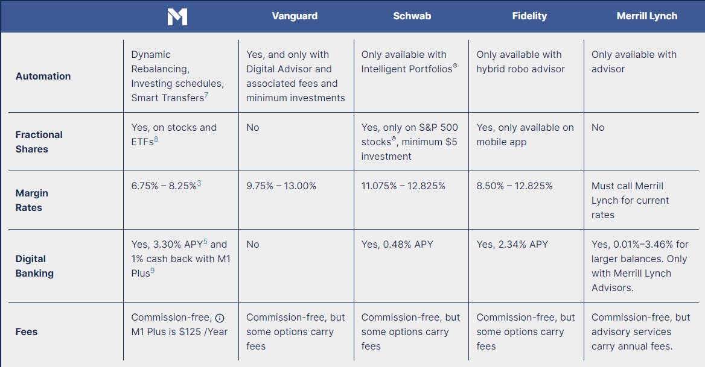
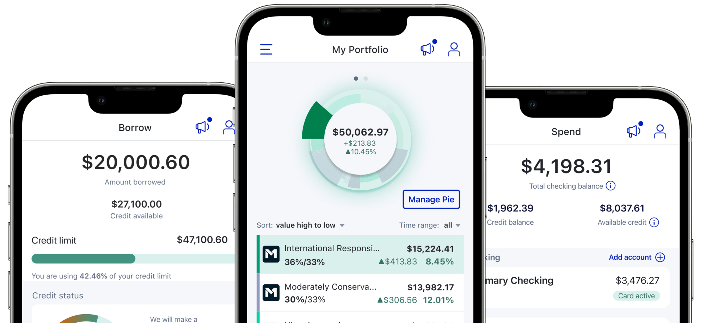

# FinTech Case Study

## Overview and Origin

* Name of the company: **M1 Finance** 

* According to the `M1 Finance` corporate website here: [M1 Finance](https://m1.com/), `M1 Finance` was incorporated on April 20th, 2015. It was founded by Brian Barnes, who remains the company's CEO. 

* Brian Barnes started M1 with the goal of building a financial institution based on technology that strives to improve individual's financial well-being over their entire lifetimes. The name M1 is a representation of this goal. According to M1's [blog](https://m1.com/blog/m1-company-name/#:~:text=M1%20defines%20the%20platform%20we,M1%20is%20synonymous%20with%20money) Economists generally define M1 as the measure of the total money supply and quantify how much liquidity exists to facilitate transactions. 

* Via [Techcrunch](https://techcrunch.com/2021/07/14/m1-finance-raises-150m-in-softbank-led-series-e-boosts-valuation-to-1-45b/) M1 Finance recently raised $150 Million in their Series E round, which officially puts them into unicorn status with a total valuation of $1.45 Billion. Since it's founding M1 has raised over $300 million. This latest round was led by SoftBank's Vision Fund 2 and previous investors include Coatue Management, Left Lane Capital, Jump Capital, and Clocktower Technology Ventures. 

## Business Activities

* M1's overall mission is to provide investing, banking, and borrowing services all through one platform. Because all services are entirely web based and their platform was built with this mission in mind, M1 is able to offer higher interest rates on deposits, lower margin rates, and several other benefits over their main competitors. 

* Finding data on M1's intended customer has not been succesful. However, based on the may they market themselves on their [corporate website](m1.com) it appears M1 is looking to do business with everyone except the "1%". The only major service for managing personal finances that M1 does not currently offer is insurance, therefor, anyone with an internet connection (and at least $100) would find value in some or all of their offerings.

* The main competitive edge that M1 holds is that their full suite of banking, investing, and borrowing is offered through a single platform. One semi-unique feature is that M! offers a subscription based tier of service that reduces rates charged on margin and some credit services. There does not seem to be much of an unfair advantage, especially considering the low barrier to entry for current and potential future competitors. Please see Image below for a detailed breakdown of how M1's investment offering compares to it's biggest competitors in this space:

* The technologies used in M1's platform are broad. This list was sourced from [Stackshare](https://stackshare.io/m1-finance/m1-finance). 

**Application and Data**
- *Javascript*
- *Python*
- *Node.js*
- *React*
- *Java*
- *NGINX*

## Landscape

* M1 operates in several FinTech domains: Investment Management, Personal Finance/Deposits/Banking, Lending, Robo-advising, and as of the summer of 2022 now operates in the Cryptocurrency space as well.

* The largest trend in these domains is the significant increase in mobile interactions. If we take Banking as one example, historically account holders were required to physically enter a bank branch in order to deposit or withdraw their funds. M1 does not opperate any physical branches and interacts with its customers only through mobile or online user interfaces. While M1 is not the only bank to operate this way, it does give them some aspect of a competitive advantage since they do not incur the costs associated. 

* Another trend that has been at least in part caused by the move to mobile, is the need for significant information security policies and procedures. M1 employs military grade cybersecurity accross its entire platform. 
 
* Due to operating in so many domains, M1 should consider its competition to be very numerous. The largest competitors accross its 3 largest domains would be:

Banking and Lending
* All national US banks
* Most regional US banks

Investing
* Charles Schwab
* Fidelity
* Merrill Lynch
* Vanguard
* E-Trade

## Results

* M1 has not necesarily revolutionized or been a game changer in the domains where they opperate. What they have accomplished is making it significantly easier to manage personal finance all in one location. There may be some critics that would say aggregating these services is a risky proposition, especially considering the events occuring in the banking industry recently. However, for those that trust the system to operate as intended, then M1 should be highly considered for all their financial needs.

* Due to M1 being a pre-IPO company, there are 2 key metrics for the management team to consider themselves succesful. However, these will change overtime.
The first is AUM (assets under management). In the second half of 2021 (most recent figure available), M1 surpassed $5 Billion in AUM. That number may not seem high for a JPM or BoA, but it does represent a 150% increase from the same time the previous year. Very Impressive.
The second metric, would be continuously increased valuations during funding rounds. As investors place more and more of their capital into M1, they are doing deep dives into the company's financials. If the metrics they are analyzing continuously improve then it can be generally agreed upon that the company is succesful. 

* As a private company, access to their financials is not something I have the ability to compare at the moment. However, considering the 150% increase in AUM, and the awards received (listed below) M1 is clearly quickly becoming a real player in this space.

## Recommendations

* If I were to consult for M1, I would recommend they enter the life/home/auto insurance industry. Or at the very least offer integrations to insurance brokers. This would, from my view, complete the personal finance needs for the vast majority of Americans.

* This service would streamline the ability for customers to gain insurance. M1 would already have much of the personal and private information on their customers that insurance brokers would ask for when applying, thus making the customer experience easier and less prone to error. 

* This new service would be possible to be built utilizing only the techstack that M1 currently operates. However, it would likely require either a brand new API or a modified version on what they currently use. 

* An API would absolutely be necesary in order to facilitate data transfer between M1 and the insurance broker. Without this, M1 would essentially only be able to direct their customers to broker websites, and that does very little to nothing to improve the client experience.

